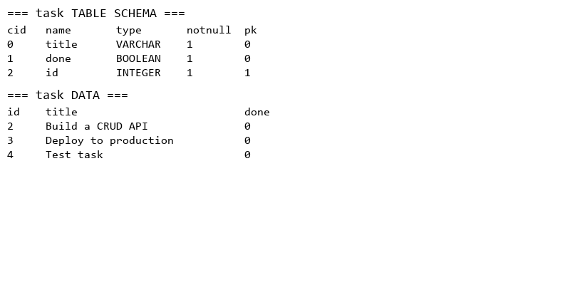

# Task CRUD API

A RESTful Task CRUD API built with **FastAPI** and **SQLModel**, backed by **SQLite**.

## Features

- Create, read, update, and delete tasks
- SQLite persistence via SQLModel/SQLAlchemy
- Auto-seeds 3 example tasks on first run (if table is empty)
- Input validation with proper HTTP status codes

## Tech Stack

| Component | Technology |
|-----------|-----------|
| Framework | FastAPI |
| ORM | SQLModel (SQLAlchemy + Pydantic) |
| Database | SQLite (tasks.db) |

## Setup

```bash
# Install dependencies
pip install -r requirements.txt

# Run the server
uvicorn main:app --reload
```

The database and seed data are created automatically on first run.

## API Endpoints

| Method | Endpoint | Description | Status Codes |
|--------|----------|-------------|--------------|
| GET | `/tasks` | List all tasks | 200 |
| GET | `/tasks/{id}` | Get a single task | 200, 404 |
| POST | `/tasks` | Create a new task | 201, 400 |
| PUT | `/tasks/{id}` | Update a task | 200, 404 |
| DELETE | `/tasks/{id}` | Delete a task | 204, 404 |

## Examples

```bash
# Create a task
curl -X POST http://localhost:8000/tasks \
  -H "Content-Type: application/json" \
  -d '{"title": "Buy groceries"}'

# List all tasks
curl http://localhost:8000/tasks

# Update a task
curl -X PUT http://localhost:8000/tasks/1 \
  -H "Content-Type: application/json" \
  -d '{"title": "Updated task", "done": true}'

# Delete a task
curl -X DELETE http://localhost:8000/tasks/1
```

## Database Schema

```sql
CREATE TABLE task (
    id    INTEGER PRIMARY KEY,
    title VARCHAR NOT NULL,
    done  BOOLEAN NOT NULL DEFAULT 0
);
```

## Screenshots


